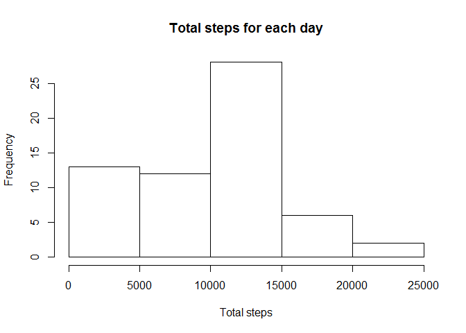
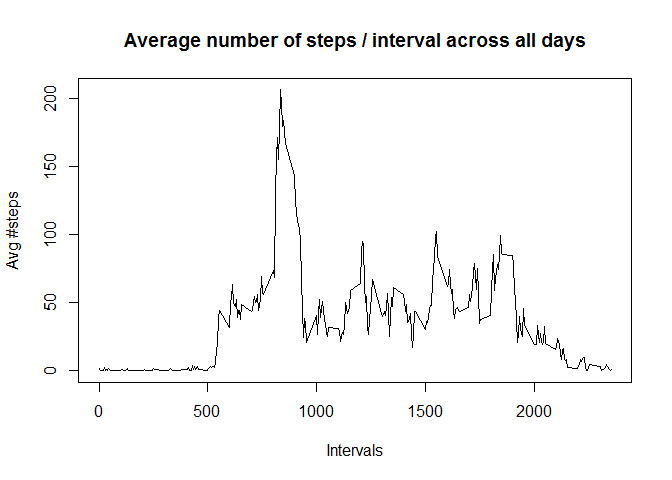
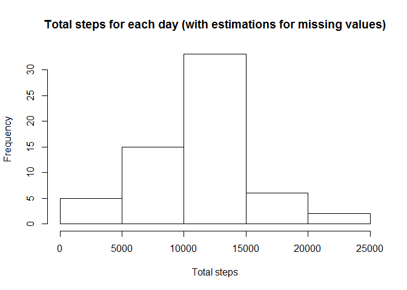
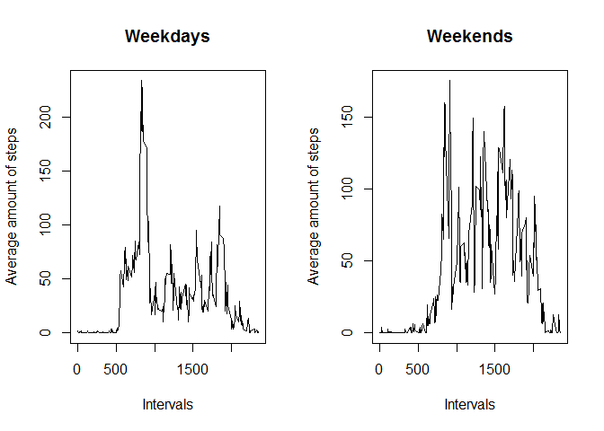

# Reproducible Research: Peer Assessment 1


## Loading and preprocessing the data

#### load data 

```r
data <- read.csv(unzip("activity.zip", "activity.csv"))
dim(data)
```

```
## [1] 17568     3
```

## What is mean total number of steps taken per day?

Generates Histogram of the total number of steps per day

```r
s <- split(data, data$date)
s.sum<-sapply(s, function(r) { sum(r$steps,na.rm=T)})
hist(s.sum, main="Total steps for each day", xlab="Total steps")
```

 

And calculate mean and median

```r
mean(s.sum)
```

```
## [1] 9354.23
```

```r
median(s.sum)
```

```
## [1] 10395
```

## What is the average daily activity pattern?

Generate a plot of a time series containing the average number of steps for each interval across all days 

```r
ts <- sapply(split(data$steps, data$interval), function(x) { mean(x, na.rm=T) } )
plot(attributes(ts)[[1]], ts, type="l", main="Average number of steps / interval across all days", 
    xlab="Intervals", ylab="Avg #steps")
```

 

Find the interval in the time series above with maximum average number of steps 

```r
attributes(ts)[[1]][which.max(ts)]
```

```
## [1] "835"
```

## Inputing missing values

The number of good values and the number of missing values are given by

```r
r.good <- sum(!is.na(data$steps))
r.missing <- sum(is.na(data$steps))
```

The number of good readings is **15264** and of missing values is **2304**.
The percentage of missing values is 

```r
r.missing/r.good*100
```

```
## [1] 15.09434
```

Checking the distribution of missing (1) values against good values (2)

```r
sapply(s, function (x) { c(sum(is.na(x$steps)), sum(!is.na(x$steps))) })
```

```
##      2012-10-01 2012-10-02 2012-10-03 2012-10-04 2012-10-05 2012-10-06
## [1,]        288          0          0          0          0          0
## [2,]          0        288        288        288        288        288
##      2012-10-07 2012-10-08 2012-10-09 2012-10-10 2012-10-11 2012-10-12
## [1,]          0        288          0          0          0          0
## [2,]        288          0        288        288        288        288
##      2012-10-13 2012-10-14 2012-10-15 2012-10-16 2012-10-17 2012-10-18
## [1,]          0          0          0          0          0          0
## [2,]        288        288        288        288        288        288
##      2012-10-19 2012-10-20 2012-10-21 2012-10-22 2012-10-23 2012-10-24
## [1,]          0          0          0          0          0          0
## [2,]        288        288        288        288        288        288
##      2012-10-25 2012-10-26 2012-10-27 2012-10-28 2012-10-29 2012-10-30
## [1,]          0          0          0          0          0          0
## [2,]        288        288        288        288        288        288
##      2012-10-31 2012-11-01 2012-11-02 2012-11-03 2012-11-04 2012-11-05
## [1,]          0        288          0          0        288          0
## [2,]        288          0        288        288          0        288
##      2012-11-06 2012-11-07 2012-11-08 2012-11-09 2012-11-10 2012-11-11
## [1,]          0          0          0        288        288          0
## [2,]        288        288        288          0          0        288
##      2012-11-12 2012-11-13 2012-11-14 2012-11-15 2012-11-16 2012-11-17
## [1,]          0          0        288          0          0          0
## [2,]        288        288          0        288        288        288
##      2012-11-18 2012-11-19 2012-11-20 2012-11-21 2012-11-22 2012-11-23
## [1,]          0          0          0          0          0          0
## [2,]        288        288        288        288        288        288
##      2012-11-24 2012-11-25 2012-11-26 2012-11-27 2012-11-28 2012-11-29
## [1,]          0          0          0          0          0          0
## [2,]        288        288        288        288        288        288
##      2012-11-30
## [1,]        288
## [2,]          0
```

We can see that missing values involve all readings of a day. 

Therefore we have to fill all intervals of the missing days with estimated values. 
The approach adopted was to input the missing values for each interval with the average number of steps for the corresponding interval on the same day of the week.

*e.g.* If all readings of a Wednesday are missing, obtain the average of readings for each interval across all Wednesdays. Then fill missing value for each interval with the calculated average for the corresponding interval.

#### Steps to estimate values for missing days

1. Include weekdays in main datasource

```r
data$weekday <- weekdays(strptime(data[,2],"%Y-%m-%d"))
```

2. Split datasets for each weekday

```r
s.wday <- split(data, data$weekday)
```

3. Obtain names of weedays

```r
w.names <- attributes(s.wday)[[1]]
```

4. Compute time series of mean number of steps / interval for each weekday 

```r
ts.w <- list()
i <- 0 
for (v in s.wday) { 
    i <- i+1;
    ts.w[[i]] <- sapply(split(v$steps, v$interval), function(r) { mean (r, na.rm=T)} )  
}
```

5. The names of weekdays obtanined in (3) correspond to the time series obtained in (4). Define a function to map dates -> weekdays (3) -> index of the time series calculated in (4)

```r
# x: string containing date in the format YYYY-mm-dd
# w.names: vector containing days of week, whose indexes correspond to tables with 
# average number of steps for that day of the week / interval
# returns: index of time series containing averages for the day of the week corresponding to 'x' 

get.day.index <- function (x, w.names) {
    x.wd <- weekdays(strptime(x, "%Y-%m-%d")); 
    which(w.names==x.wd)
}
```

6. Finally, create a replica of the original dataset, filling in values for days with missing readings using estimated values for the corresponding weekday

```r
s.new <- s
for (i in 1:length(s.new)) {
    is.missing <- sum(is.na(s.new[[i]]$steps)) != 0    
    if (is.missing) {
        x <- s.new[[i]]
        day.index <- get.day.index(x$date[1],w.names)
        x$steps <- ts.w[[day.index]]
        s.new[[i]] <- x
    }
}
data.new <- unsplit(s.new, data$date)
```

7. Plot the histogram with the total of steps per each day using dataset containing estimated values

```r
s.new.sum<-sapply(s.new, function(r) { sum(r$steps)})
hist(s.new.sum, main="Total steps for each day (with estimations for missing values)", xlab="Total steps")
```

 

and calculate mean and median over the new dataset.

```r
mean(s.new.sum)
```

```
## [1] 10821.21
```

```r
median(s.new.sum)
```

```
## [1] 11015
```

Comparing against the histogram obtained for the original dataset, which desconsidered NA values, there are two perceptible differences:

* There is a bias of higher frequency towards the range of 0-5000 steps for the original dataset. In the dataset using estimated values, the frequency for the same range is significantly lower.

* As a consequence, the peak of frequency is higher for the range of 10K-15k steps in the histogram using estimated values compared to the dataset including NAs.

Additionally, the mean and median are higher for the dataset including estimated values as well.

## Are there differences in activity patterns between weekdays and weekends?

First, set a weekend flag in the main datasource

```r
data$isWeekend <- data$weekday %in% c("Saturday", "Sunday")
```

And calculate a time series for weekends and weekdays

```r
ts.weekend <- with(data[data$isWeekend,], sapply(split(steps, interval), function(x) { mean(x, na.rm=T) }))
ts.weekday <- with(data[!data$isWeekend,], sapply(split(steps, interval), function(x) { mean(x, na.rm=T) }))
```

Show the plot for both time series

```r
par(mfrow = c(1, 2))
plot(attributes(ts.weekday)[[1]], ts.weekday, type="l", main="Weekdays", xlab="Intervals", ylab="Average amount of steps")
plot(attributes(ts.weekend)[[1]], ts.weekend, type="l", main="Weekends", xlab="Intervals", ylab="Average amount of steps")
```

 

Comparing both plots we can see reasonable differences between the activity patterns.

* Weekdays: There is a peek of activity in the morning (reaching over 200 steps) followed by moderate activity along the day (less than 200 steps). There is a a smaller spike by the end of the working hours (over 100) which closes the amount of activity for the day.

* Weekends: The peek of activity in the morning remains, slightly smaller than during the weekdays. Howerver the amount of activity is reasonably distributed along the day and suddenly drops at night. 
